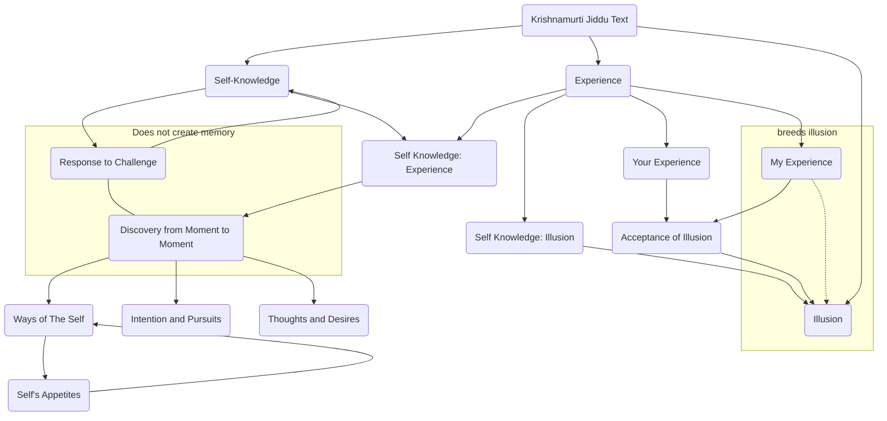

January 25
Active self-knowledge

Without self-knowledge, experience breeds illusion; with self-knowledge, experience, which is the response to challenge, does not leave a cumulative residue as memory. Self- knowledge is the discovery from moment to moment of the ways of the self, its intentions and pursuit, its thoughts and appetites. There can never be “your experience” and “my experience”; the very term “my experience” indicates ignorance and the acceptance of illusion.

