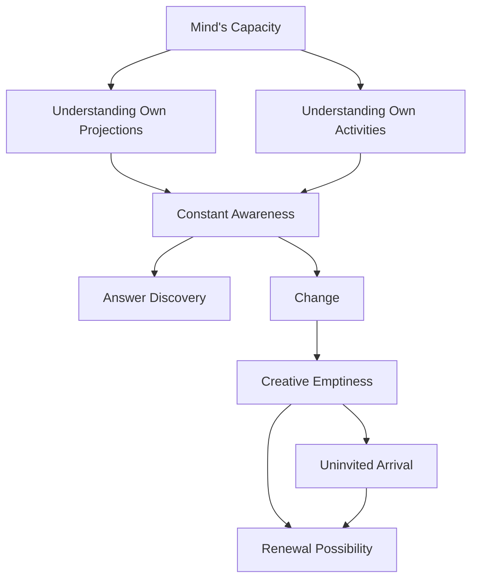

January 29
Creative emptiness

Create a Mermaid Concept Map Diagram in text format identifying key concepts and keeping their names short  and name their relationships from this corresponding underlying text below from Jiddu Krishnamurti,  do not provide explanations or any further list or notes, only provide this Mermaid Concept Map Diagram in text format.

Can you not just listen to this as the soil receives the seed and see if the mind is capable of being free, empty? It can be empty only by understanding all its own projections, its own activities, not off and on, but from day to day, from moment to moment. Then you will find the answer, then you will see that the change comes without your asking, that the state of creative emptiness is not a thing to be cultivated—it is there, it comes darkly, without any invitation, and only in that state is there a possibility of renewal, newness, revolution.

