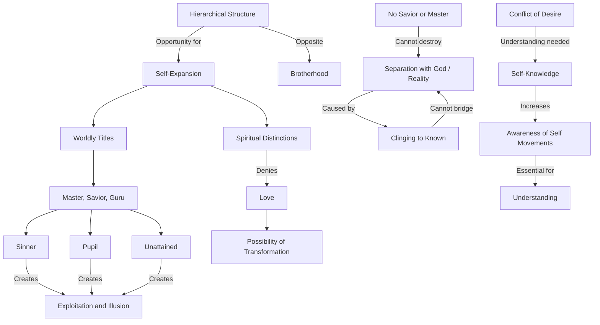

February 4
Opportunities for self-expansion

...Hierarchical structure offers an excellent opportunity for self-expansion. You may want brotherhood, but how can there be brotherhood if you are pursuing spiritual distinctions? You may smile at worldly titles; but when you admit the Master, the savior, the guru in the realm of the spirit, are you not carrying over the worldly attitude? Can there be hierarchical divisions or degrees in spiritual growth, in the understanding of truth, in the realization of God? Love admits no division. Either you love, or do not love; but do not make the lack of love into a long drawn out process whose end is love. When you know you do not love, when you are choicelessly aware of that fact, then there is a possibility of transformation; but to sedulously cultivate this distinction between the Master and the pupil, between those who have attained and those who have not, between the savior and the sinner, is to deny love. The exploiter, who is in turn exploited, finds a happy hunting ground in this darkness and illusion.
...Separation between God or reality and yourself is brought about by you, by the mind that clings to the known, to certainty, to security. This separation cannot be bridged over; there is no ritual, no discipline, no sacrifice that can carry you across it; there is no savior, no Master, no guru who can lead you to the real or destroy this separation. The division is not between the real and yourself; it is in yourself.
...What is essential is to understand the increasing conflict of desire; and this understanding comes only through self-knowledge and constant awareness of the movements of the self.

