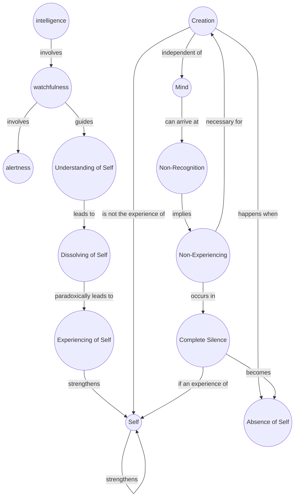

February 5
Beyond all experiencing

Understanding of the self requires a great deal of intelligence, a great deal of watchfulness, alertness, watching ceaselessly, so that it does not slip away. I who am very earnest, want to dissolve the self. When I say that, I know it is possible to dissolve the self. Please be patient. The moment I say “I want to dissolve this,” and in the process I follow for the dissolution of that, there is the experiencing of the self; and so, the self is strengthened. So, how is it possible for the self not to experience? One can see that creation is not at all the experience of the self. Creation is when the self is not there, because creation is not intellectual, is not of the mind, is not self-projected, is something beyond all experiencing, as we know it. Is it possible for the mind to be quite still, in a state of non-recognition, which is, non-experiencing, to be in a state in which creation can take place—which means, when the self is not there, when the self is absent? Am I making myself clear or not?...The problem is this, is it not? Any movement of the mind, positive or negative, is an experience which actually strengthens the “me”. Is it possible for the mind not to recognize? That can only take place when there is complete silence, but not the silence which is an experience of the self and which therefore strengthens the self.

