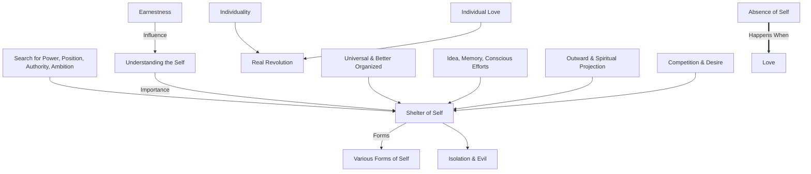

February 6 
What is the self?

The search for power, position, authority, ambition and all the rest are the forms of the self in all its different ways. But what is important is to understand the self and I am sure you and I are convinced of it. If I may add here, let us be earnest about this matter; because I feel that if you and I as individuals, not as a group of people belonging to certain classes, certain societies, certain climatic divisions, can understand this and act upon this, then I think there will be real revolution. The moment it becomes universal and better organized, the self takes shelter in that; whereas, if you and I as individuals can love, can carry this out actually in everyday life, then the revolution that is so essential will come into being...
You know what I mean by the self? By that, I mean the idea, the memory, the conclusion, the experience, the various forms of namable and unnamable intentions, the conscious endeavor to be or not to be, the accumulated memory of the unconscious, the racial, the group, the individual, the clan, and the whole of it all, whether it is projected outwardly in action, or projected spiritually as virtue; the striving after all this is the self. In it is included the competition, the desire to be. The whole process of that, is the self; and we know actually when we are faced with it, that it is an evil thing. I am using the word evil intentionally, because the self is dividing; the self is self-enclosing; its activities, however noble, are separated and isolated. We know all this. We also know that extraordinary are the moments when the self is not there, in which there is no sense of endeavor, of effort, and which happens when there is love.

