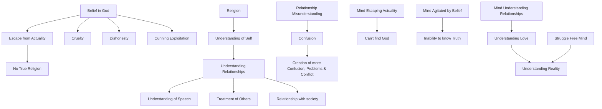

February 10
Agitated by belief

Create a Mermaid Concept Map Diagram in text format identifying key concepts and keeping their names short  and name their relationships from this corresponding underlying text below from Jiddu Krishnamurti,  do not provide explanations or any further list or notes, only provide this Mermaid Concept Map Diagram in text format.

So, your religion, your belief in God, is an escape from actuality, and therefore it is no religion at all. The rich man who accumulates money through cruelty, through dishonesty, through cunning exploitation believes in God; and you also believe in God, you also are cunning, cruel, suspicious, envious. Is God to be found through dishonesty, through deceit, through cunning tricks of the mind? Because you collect all the sacred books and the various symbols of God, does that indicate that you are a religious person? So, religion is not escape from the fact; religion is the understanding of the fact of what you are in your everyday relationships; religion is the manner of your speech, the way you talk, the way you address your servants, the way you treat your wife, your children, and neighbors. As long as you do not understand your relationship with your neighbor, with society, with your wife and children, there must be confusion; and whatever it does, the mind that is confused will only create more confusion, more problems and conflict. A mind that escapes from the actual, from the facts of relationship, shall never find God; a mind that is agitated by belief shall not know truth. But the mind that understands its relationship with property, with people, with ideas, the mind which no longer struggles with the problems which relationship creates, and for which the solution is not withdrawal but the understanding of love—such a mind alone can understand reality.

