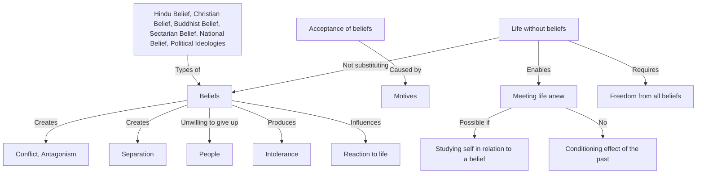

February 13
Meeting life anew

One of the things, it seems to me, that most of us eagerly accept and take for granted is the question of beliefs. I am not attacking beliefs. What we are trying to do is to find out why we accept beliefs; and if we can understand the motives, the causation of acceptance, then perhaps we may be able not only to understand why we do it, but also be free of it. One can see how political and religious beliefs, national and various other types of beliefs, do separate people, do create conflict, confusion, and antagonism which is anobvious fact; and yet we are unwilling to give them up. There is the Hindu belief, the Christian belief, the Buddhist innumerable sectarian and national beliefs, various political ideologies, all contending with one other, trying to convert one other. One can see, obviously, that belief is separating people, creating intolerance; is it possible to live without belief? One can find that out only if one can study oneself in relationship to a belief. Is it possible to live in this world without a belief not change beliefs, not substitute one belief for another, but be entirely free from all beliefs, so that one meets life anew each minute? This, after all, is the truth: to have the capacity of meeting everything anew, from moment to moment, without the conditioning reaction of the past, so that there is not the cumulative effect which acts as a barrier between oneself and that which is.

