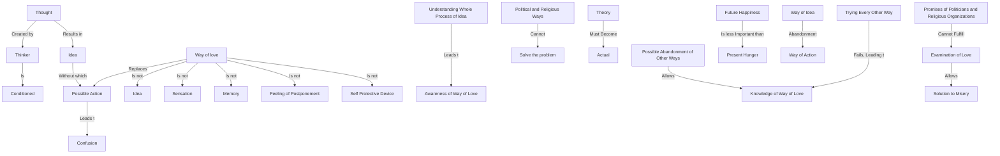

February 21
Acting without idea is the way of love

Thought must always be limited by the thinker who is conditioned; the thinker is always conditioned and is never free; if thought occurs, immediately idea follows. Idea in order to act is bound to create more confusion. Knowing all this, is it possible to act without idea? Yes, it is the way of love. Love is not an idea; it is not a sensation; it is not a memory; it is not a feeling of postponement, a self protective device. We can only be aware of the way of love when we understand the whole process of idea. Now, is it possible to abandon the other ways and know the way of love which is the only redemption? No other way, political or religious, will solve the problem. This is not a theory which you will have to think over and adopt in your life; it must be actual...
...When you love, is there idea? Do not accept it; just look at it, examine it, go into it profoundly; because every other way we have tried, and there is no answer to misery.Politicians may promise it; the so called religious organizations may promise future happiness; but we have not got it now, and the future is relatively unimportant when I am hungry. We have tried every other way; and we can only know the way of love if we know the way of idea and abandon idea, which is to act.

