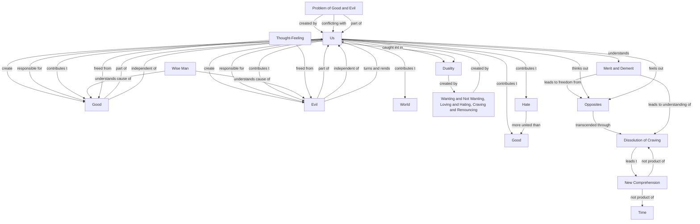

February 23
Beyond duality

Are you not aware of it? Are not its actions obvious, its sorrow crushing? Who has created it but each one of us? Who is responsible for it but each one of us? As we have created good, however little, so we have created evil, however vast. Good and evil are part of us and are also independent of us. When we think-feel narrowly, enviously, with greed and hate, we are adding to the evil which turns and rends us. This problem of good and evil, this conflicting problem, is always with us as we are creating it. It has become part of us, this wanting and not wanting, loving and hating, craving and renouncing. We are continually creating this duality in which thought-feeling is caught up. Thought- feeling can go beyond and above good and its opposite only when it understands its cause—craving. In understanding merit and demerit there is freedom from both. Opposites cannot be fused and they are to be transcended through the dissolution of craving. Each opposite must be thought out, felt out, as extensively and deeply as possible, through all the layers of consciousness; through this thinking out, feeling out, a new comprehension is awakened which is not the product of craving or of time.
There is evil in the world to which we are contributing as we contribute to the good. Man seems to unite more in hate than in good. A wise man realizes the cause of evil and good, and through understanding frees thought-feeling from it.

