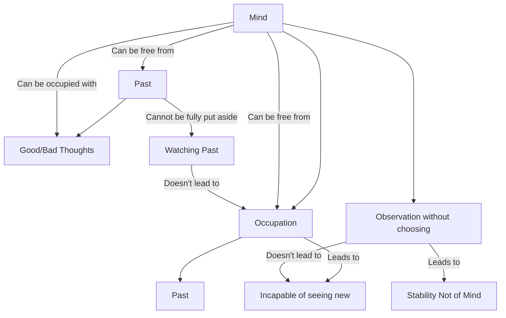

February 27
Freedom from occupation

Can the mind be free from the past, free from thought—not from the good or bad thought? How do I find out? I can only find out by seeing what the mind is occupied with. If my mind is occupied with the good or occupied with the bad, then it is only concerned with the past, it is occupied with the past. It is not free of the past. So, what is important is to find out how the mind is occupied. If it is occupied at all, it is always occupied with the past because all our consciousness is the past. The past is not only on the surface but on the highest level, and the stress on the unconscious is also the past. Can the mind be free from occupation? This means—can the mind be completely without being occupied and let memory, the thoughts good and bad, go by without choosing? The moment the mind is occupied with one thought, good or bad, then it is concerned with the past...If you really listen—not just merely verbally, but really profoundly—then you will see that there is stability which is not of the mind, which is the freedom from the past.
Yet, the past can never be put aside. There is a watching of the past as it goes by, but not occupation with the past. So the mind is free to observe and not to choose. Where there is choice in this movement of the river of memory, there is occupation; and the moment the mind is occupied, it is caught in the past; and when the mind is occupied with the past, it is incapable of seeing something real, true, new, original, uncontaminated.

