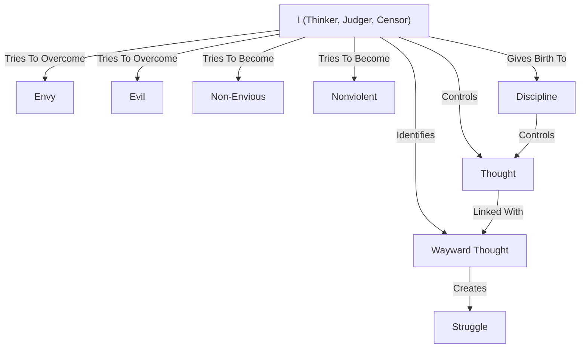

February 28
Thinking begets effort

“How can I remain free from evil thoughts, evil and wayward thoughts?” ...Is there the thinker, the one apart from thought, apart from the evil, wayward thoughts? Please watch your own mind. We say, “There is the I, the me that says,” “This is a wayward thought,” “This is bad,” “I must control this thought,” “I must keep to this thought.” That is what we know. Is the one, the I, the thinker, the judger, the one that judges, the censor, different from all this? Is the I different from thought, different from envy, different from evil? The I which says that it is different from this evil is everlastingly trying to overcome me, trying to push me away, trying to become something. So you have this struggle, the effort to put away thoughts, not to be wayward.
We have, in the very process of thinking, created this problem of effort. Do you follow? Then you give birth to discipline, controlling thought—the I controlling the thought which is not good, the I which is trying to become non-envious, nonviolent, to be this and to be that. So you have brought into being the very process of effort when there is the I and the thing which it is controlling. That is the actual fact of our everyday existence.

