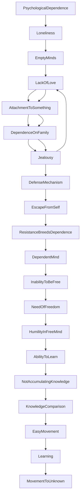

March 1
A free mind has humility

Have you ever gone into the question of psychological dependence? If you go into it very deeply, you will find that most of us are terribly lonely. Most of us have such shallow, empty minds. Most of us do not know what love means. So, out of that loneliness, out of that insufficiency, out of the privation of life, we are attached to something, attached to the family; we depend upon it. And when the wife or the husband turns away from us, we are jealous. Jealousy is not love; but the love which society acknowledges in the family ismade respectable. That is another form of defense, another form of escape from ourselves. So every form of resistance breeds dependence. And a mind that is dependent can never be free.
You need to be free, because you will see that a mind that is free has the essence of humility. Such a mind, which is free and therefore has humility, can learn—not a mind that resists. Learning is an extraordinary thing—to learn, not to accumulate knowledge. Accumulating knowledge is quite a different thing. What we call knowledge is comparatively easy, because that is a movement from the known to the known. But to learn is a movement from the known to the unknown—you learn only like that, do you not?

