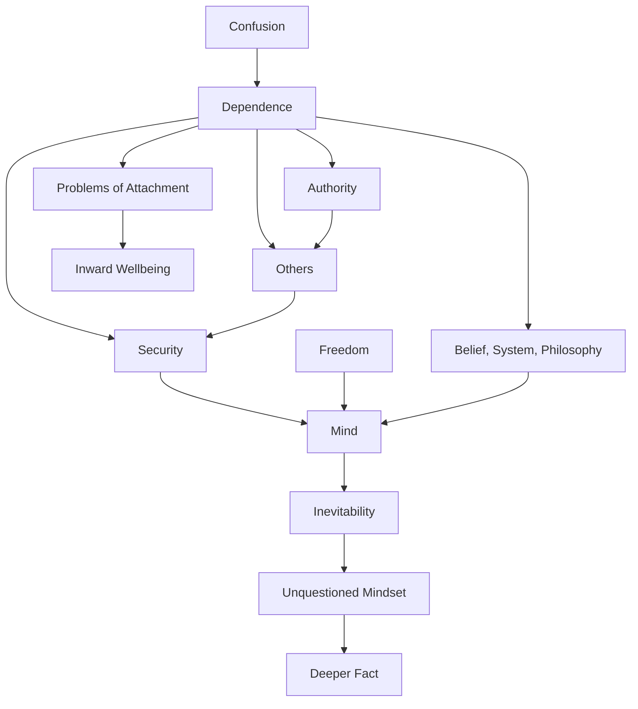

March 2
We never question the problem of dependence

Why do we depend? Psychologically, inwardly, we depend on a belief, on a system, on a philosophy; we ask another for a mode of conduct; we seek teachers who will give us a way of life which will lead us to some hope, some happiness. So we are always, are we not, searching for some kind of dependence, security. Is it possible for the mind ever to free itself from this sense of dependence? Which does not mean that the mind must achieve independence—that is only the reaction to dependence. We are not talking of independence, of freedom from a particular state. If we can inquire without the reaction of seeking freedom from a particular state of dependence, then we can go much more deeply into it...We accept the necessity for dependence; we say it is inevitable. We have never questioned the whole issue at all, why each one of us seeks some kind of dependence. Is it not that we really, deep down, demand security, permanency? Being in a state of confusion, we want someone to get us out of that confusion. So, we are always concerned with how to escape or avoid the state in which we are. In the process of avoiding that state, we are bound to create some kind of dependence, which becomes our authority. If we depend on another for our security, for our inward wellbeing, there arise out of that dependence innumerable problems, and then we try to solve those problems— the problems of attachment. But we never question, we never go into the problem of dependence itself. Perhaps if we can really intelligently, with full awareness, go into this problem, then we may find that dependence is not the issue at all—that it is only a way of escaping from a deeper fact.

