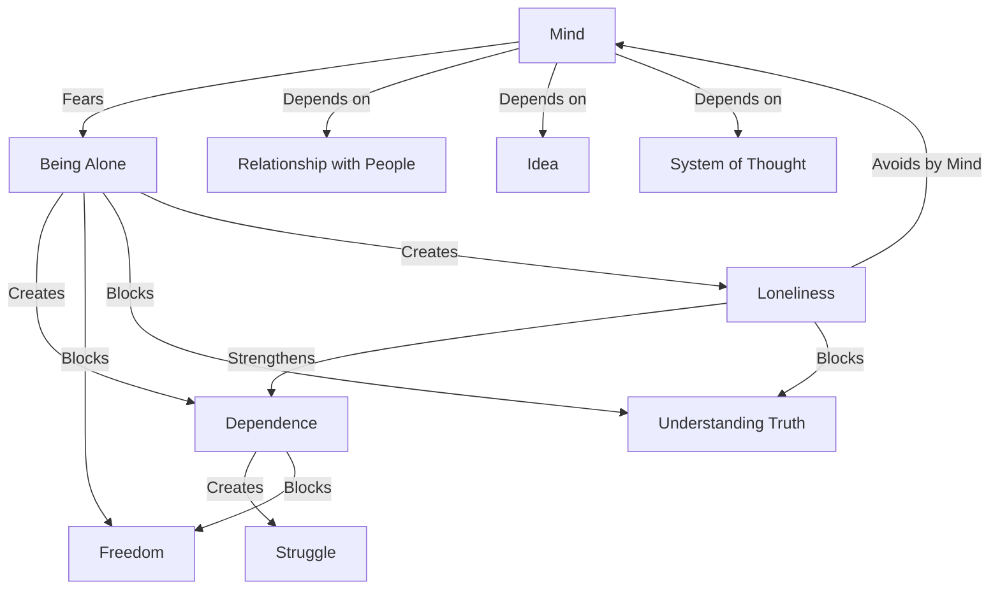

March 3
There is some deeper factor that makes us depend

We know we depend—on our relationship with people or on some idea or on a system of thought. Why?
...Actually, I do not think dependence is the problem; I think there is some other deeper factor that makes us depend. And if we can unravel that, then both dependence and the struggle for freedom will have very little significance; then all the problems which arise through dependence will wither away. So, what is the deeper issue? Is it that the mindabhors, fears, the idea of being alone? And does the mind know that state which it avoids?...So long as that loneliness is not really understood, felt, penetrated, dissolved— whatever word you may like to use—so long as that sense of loneliness remains, dependence is inevitable, and one can never be free; one can never find out for oneself that which is true, that which is religion.

