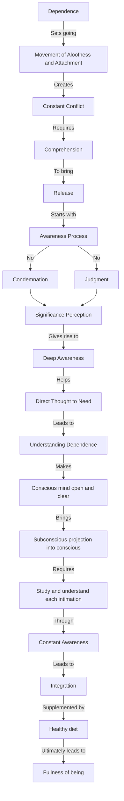

March 4
Become deeply aware

Dependence sets going the movement of aloofness and attachment, a constant conflict without comprehension, without a release. You must become aware of the process of attachment and dependence, become aware of it without condemnation, without judgment, and then you will perceive the significance of this conflict of opposites. If you become deeply aware and consciously direct thought to comprehend the full meaning of need, of dependence, your conscious mind will be open and clear about it; and then the subconscious with its hidden motives, pursuits and intentions, will project itself into the conscious. When this happens, you must study and understand each intimation of the subconscious If you do this many times, becoming aware of the projections of the subconscious after the conscious has thought out the problem as clearly as possible, then, even though you give your attention to other matters, the conscious and the subconscious will work out the problem of dependence, or any other problem. Thus there is established a constant awareness which will patiently and gently bring about integration; and if your health and diet are all right, this will in turn bring about fullness of being.

