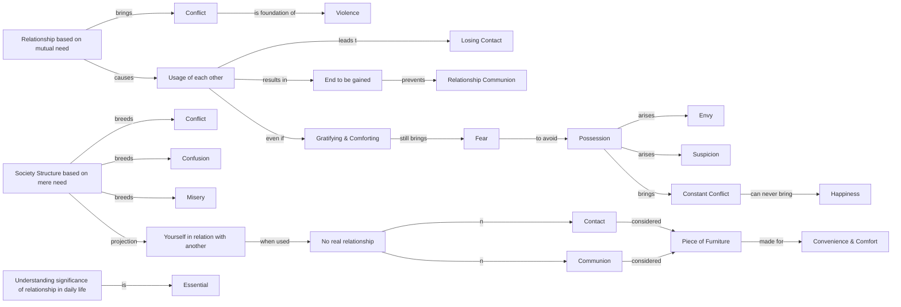

March 5
Relationship

Relationship based on mutual need brings only conflict. However interdependent we are on each other, we are using each other for a purpose, for an end. With an end in view, relationship is not. You may use me and I may use you. In this usage, we lose contact. A society based on mutual usage is the foundation of violence. When we use another, we have only the picture of the end to be gained. The end, the gain, prevents relationship, communion. In the usage of another, however gratifying and comforting it may be, there is always fear. To avoid this fear, we must possess. From this possession there arises envy, suspicion, and constant conflict. Such a relationship can never bring about happiness.
A society whose structure is based on mere need, whether physiological or psychological, must breed conflict, confusion and misery. Society is the projection of yourself in relation with another, in which the need and the use are predominant. When you use another for your need, physically or psychologically, in actuality there is no relationship at all; you really have no contact with the other, no communion with the other. How can you have communion with the other when the other is used as a piece of furniture, for your convenience and comfort? So, it is essential to understand the significance of relationship in daily life.

