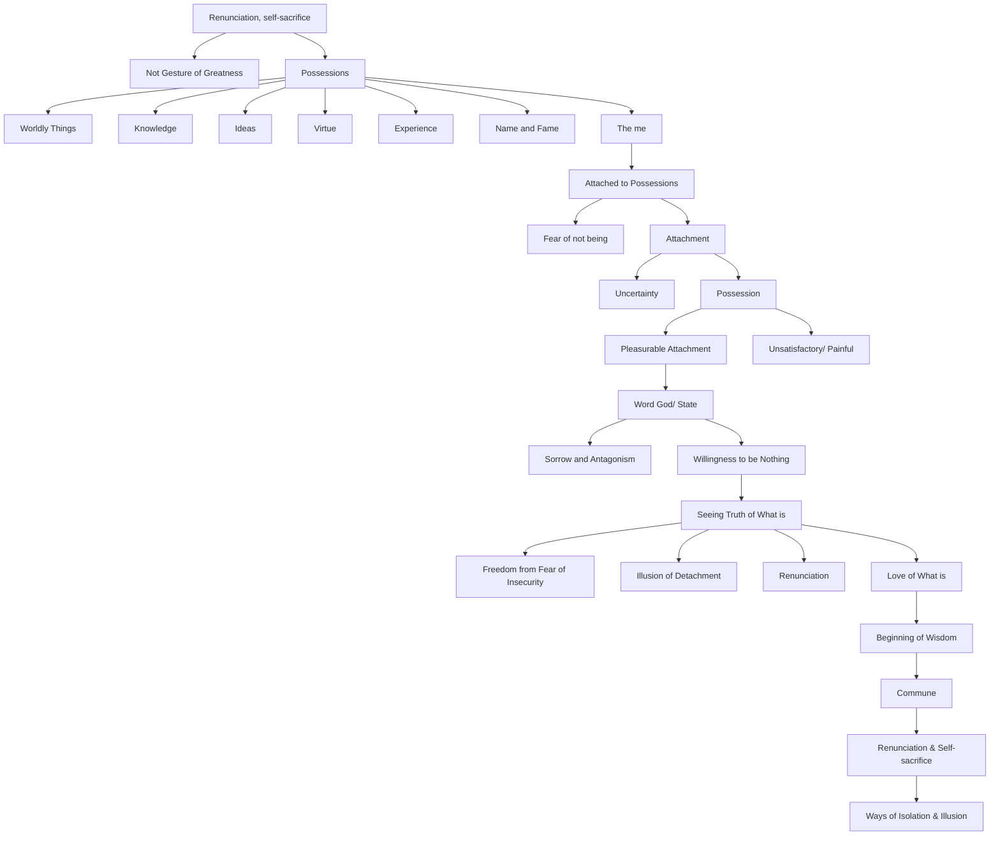

March 6
The “me” is the possession

Renunciation, self-sacrifice, is not a gesture of greatness, to be praised and copied. We possess because without possession we are not. Possessions are many and varied. One who possesses no worldly things may be attached to knowledge, to ideas; another may be attached to virtue, another to experience, another to name and fame, and so on. Without possessions, the “me” is not; the “me” is the possession, the furniture, the virtue, the name. In its fear of not being, the mind is attached to name, to furniture, to value; and it will drop these in order to be at a higher level, the higher being the more gratifying, the more permanent. The fear of uncertainty, of not being, makes for attachment, for possession. When the possession is unsatisfactory or painful, we renounce it for a more pleasurable attachment. The ultimate gratifying possession is the word God, or its substitute, the State.
...So long as you are unwilling to be nothing, which in fact you are, you must inevitably breed sorrow and antagonism. The willingness to be nothing is not a matter of renunciation, of enforcement, inner or outer, but of seeing the truth of what is. Seeing the truth of what is brings freedom from the fear of insecurity, the fear which breeds attachment and leads to the illusion of detachment, renunciation. The love of what is is the beginning of wisdom. Love alone shares, it alone can commune; but renunciation and self-sacrifice are the ways of isolation and illusion.

