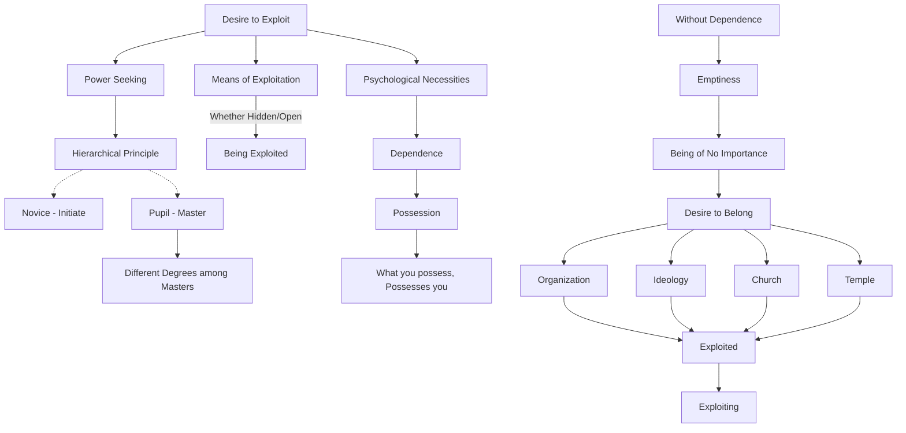

March 7
To exploit is to be exploited

As most of us seek power in one form or another, the hierarchical principle is established, the novice and the initiate, the pupil and the Master, and even among the Masters there are degrees of spiritual growth. Most of us love to exploit and be exploited, and this system offers the means, whether hidden or open. To exploit is to be exploited. The desire to use others for your psychological necessities makes for dependence, and when you depend you must hold, possess; and what you possess, possesses you. Without dependence, subtle or gross, without possessing things, people and ideas, you are empty, a thing of no importance. You want to be something, and to avoid the gnawing fear of being nothing you belong to this or that organization, to this or that ideology, to this church or that temple; so you are exploited, and you in your turn exploit.

