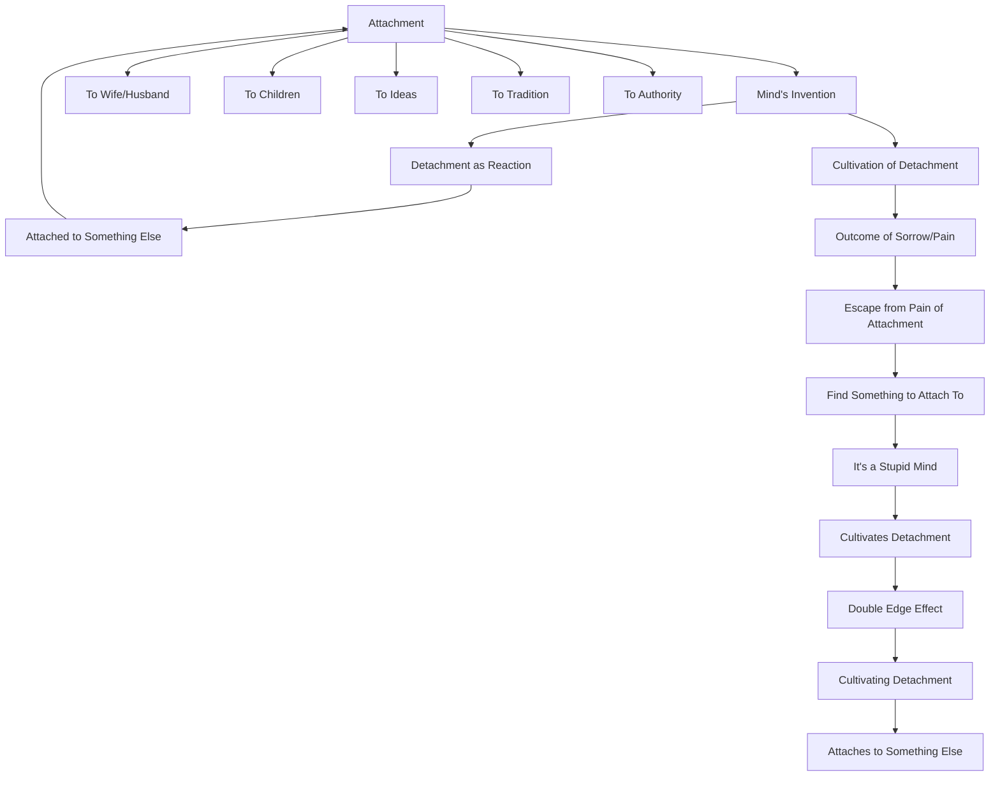

March 8
The cultivation of detachment

There is only attachment; there is no such thing as detachment. The mind invents detachment as a reaction to the pain of attachment. When you react to attachment by becoming “detached,” you are attached to something else. So that whole process is one of attachment. You are attached to your wife or your husband, to your children, to ideas, to traditio n, to authority, and so on; and your reaction to that attachment is detachment. The cultivation of detachment is the outcome of sorrow, pain. You want to escape from thepain of attachment, and your escape is to find something to which you think you can be attached. So there is only attachment, and it is a stupid mind that cultivates detachment. All the books say, “Be detached,” but what is the truth of the matter? If you observe your own mind, you will see an extraordinary thing—that through cultivating detachment, your mind is becoming attached to something else.

