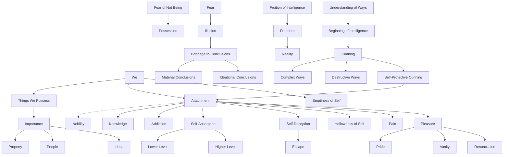

March 9
Attachment is self-deception

We are the things we possess, we are that to which we are attached. Attachment has no nobility. Attachment to knowledge is not different from any other gratifying addiction. Attachment is self-absorption, whether at the lowest or at the highest level. Attachment is self-deception, it is an escape from the hollowness of the self. The things to which we are attached—property, people, ideas—become all-important, for without the many things which fill its emptiness, the self is not. The fear of not being makes for possession; and fear breeds illusion, the bondage to conclusions. Conclusions, material or ideational, prevent the fruition of intelligence, the freedom in which alone reality can come into being; and without this freedom, cunning is taken for intelligence. The ways of cunning are always complex and destructive. It is this self-protective cunning that makes for attachment; and when attachment causes pain, it is this same cunning that seeks detachment and finds pleasure in the pride and vanity of renunciation. The understanding of the ways of cunning, the ways of the self, is the beginning of intelligence.

