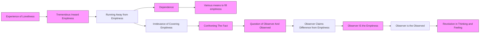

March 10
Face the fact and see what happens...

We have all had the experience of tremendous loneliness, where books, religion, everything is gone and we are tremendously, inwardly, lonely, empty. Most of us can’t face that emptiness, that loneliness, and we run away from it. Dependence is one of the things we run to, depend on, because we can’t stand being alone with ourselves. We must have the radio or books or talking, incessant chatter about this and that, about art and culture. So we come to that point when we know there is this extraordinary sense of self- isolation. We may have a very good job, work furiously, write books, but inwardly there is this tremendous vacuum. We want to fill that and dependence is one of the ways. We use dependence, amusement, church work, religions, drink, women, a dozen things to fill it up, cover it up. If we see that it is absolutely futile to try to cover it up, completely futile—not verbally, not with conviction and therefore agreement and determination—but if we see the total absurdity of it...then we are faced with a fact. It is not a question of how to be free from dependence; that’s not a fact; that’s only a reaction to a fact...Why don’t I face the fact and see what happens?
The problem now arises of the observer and the observed. The observer says, “I am empty; I don’t like it,” and runs away from it. The observer says, “I am different from the emptiness.” But the observer is the emptiness; it is not emptiness seen by an observer. The observer is the observed. There is a tremendous revolution in thinking, in feeling, when that takes place.

