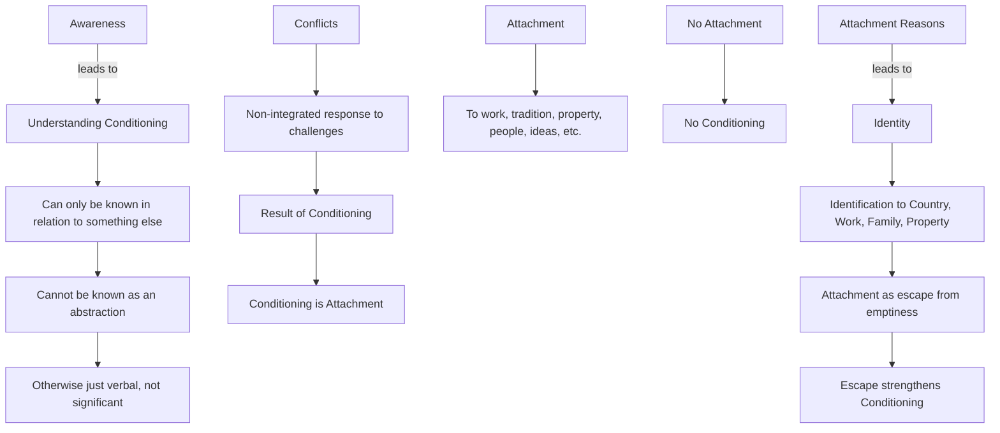

March 11
Attachment is escape

Just try to be aware of your conditioning. You can only know it indirectly, in relation to something else. You cannot be aware of your conditioning as an abstraction, for then it is merely verbal, without much significance. We are only aware of conflict. Conflict exists when there is no integration between challenge and response. This conflict is the result of our conditioning. Conditioning is attachment: attachment to work, to tradition, to property, to people, to ideas, and so on. If there were no attachment, would there be conditioning? Of course not. So why are we attached? I am attached to my country because through identification with it I become somebody. I identify myself with my work, and the work becomes important, I am my family, my property; I am attached to them. The object of attachment offers me the means of escape from my own emptiness. Attachment is escape, and it is escape that strengthens conditioning.

