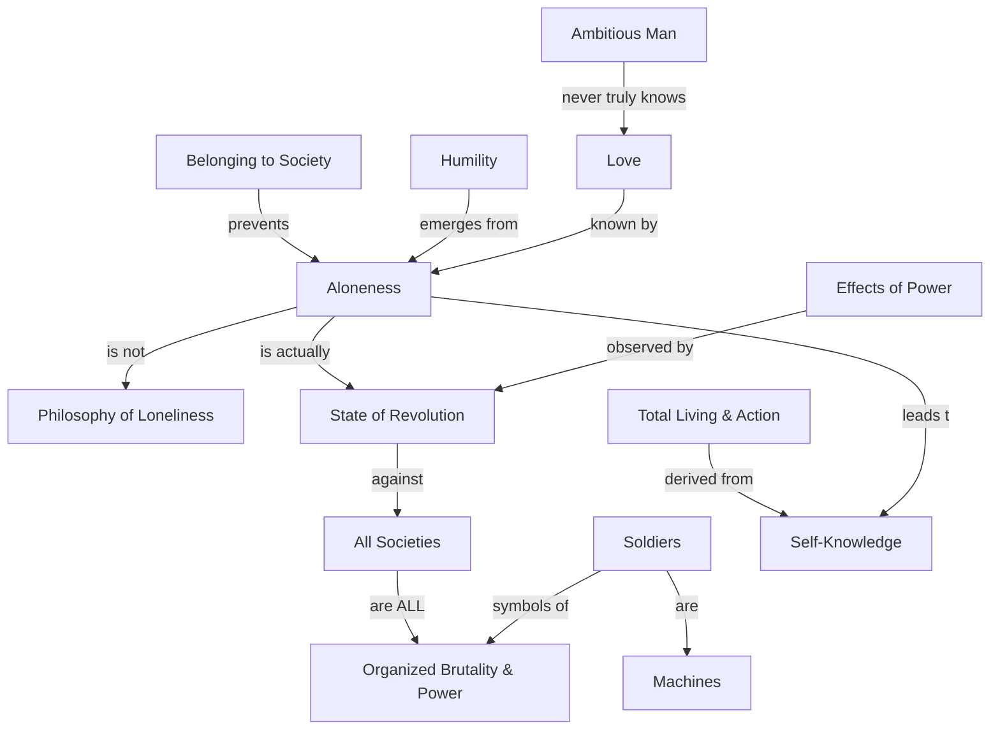

March 12
To be alone

To be alone, which is not a philosophy of loneliness, is obviously to be in a state of revolution against the whole setup of society—not only this society, but the communist society, the fascist, every form of society as organized brutality, organized power. And that means an extraordinary perception of the effects of power. Sir, have you noticed those soldiers rehearsing? They are not human beings any more, they are machines, they are your sons and my sons, standing there in the sun. This is happening here, in America, in Russia, and everywhere—not only at the governmental level, but also at the monastic level, belonging to monasteries, to orders, to groups who employ astonishing power. And it is only the mind which does not belong that can be alone. And aloneness is not something to be cultivated. You see this? When you see all this, you are out, and no governor or president is going to invite you to dinner. Out of that aloneness there is humility. It is this aloneness that knows love—not power. The ambitious man, religious or ordinary, will never know what love is. So, if one sees all this, then one has this quality of total living and therefore total action. This comes through self-knowledge.

