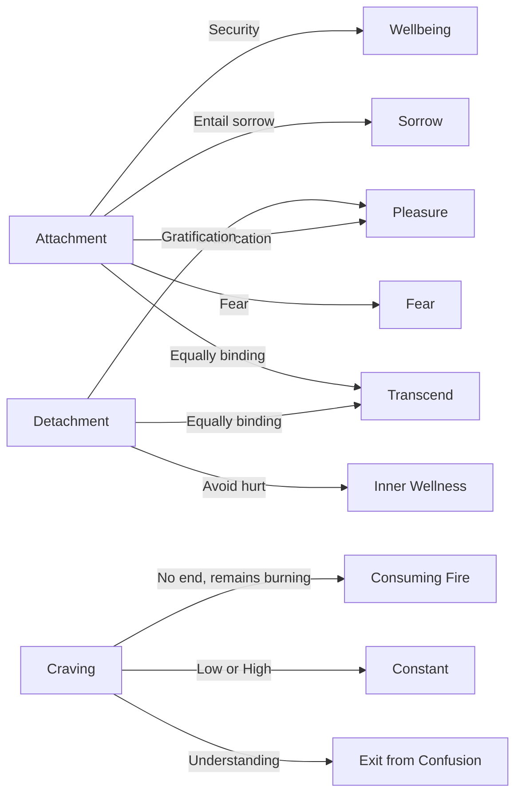

March 13
Craving is always craving

To avoid suffering we cultivate detachment. Being forewarned that attachment sooner or later entails sorrow, we want to become detached. Attachment is gratifying, but perceiving the pain in it, we want to be gratified in another manner, through detachment. Detachment is the same as attachment as long as it yields gratification. So what we are really seeking is gratification, we crave to be satisfied by whatever means.
We are dependent or attached because it gives us pleasure, security, power, a sense of wellbeing, though in it there is sorrow and fear. We seek detachment also for pleasure, in order not to be hurt, not to be inwardly wounded. Our search is for pleasure, gratification.Without condemning or justifying we must try to understand this process, for unless we understand it there is no way out of our confusion and contradiction. Can craving ever be satisfied, or is it a bottomless pit? Whether we crave for the low or for the high, craving is always craving, a burning fire, and what can be consumed by it soon becomes ashes; but craving for gratification still remains, ever burning, ever consuming, and there is no end to it. Attachment and detachment are equally binding, and both must be transcended.

