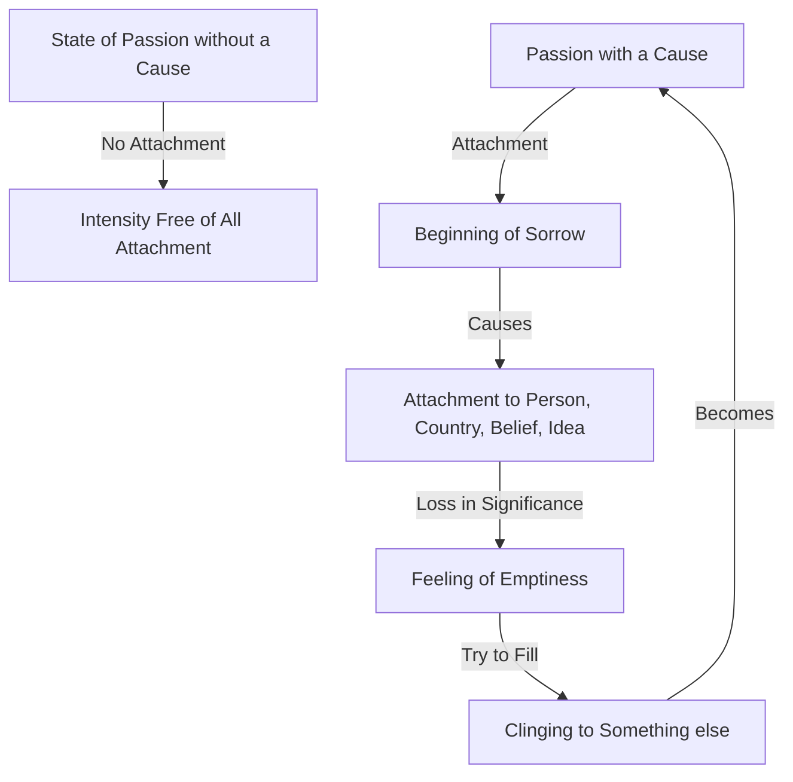

March 14
Intensity free of all attachment

In the state of passion without a cause, there is intensity free of all attachment; but when passion has a cause, there is attachment and attachment is the beginning of sorrow. Most of us are attached; we cling to a person, to a country, to a belief, to an idea, and when the object of our attachment is taken away or otherwise loses its significance, we find ourselves empty, insufficient. This emptiness we try to fill by clinging to something else, which again becomes the object of our passion.

