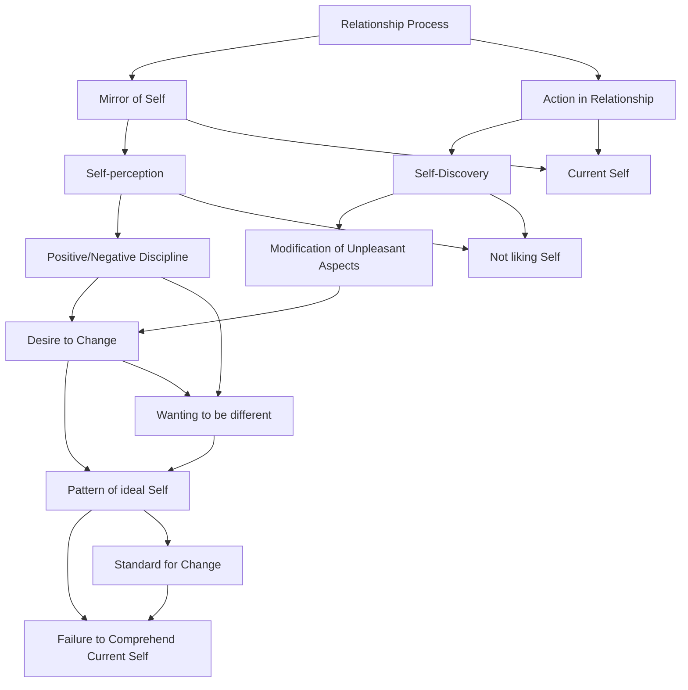

March 15
Relationship is a mirror

Surely, only in relationship the process of what I am unfolds, does it not? Relationship is a mirror in which I see myself as I am; but as most of us do not like what we are, we begin to discipline, either positively or negatively, what we perceive in the mirror of relationship. That is, I discover something in relationship, in the action of relationship, and I do not like it. So, I begin to modify what I do not like, what I perceive as being unpleasant. I want to change it—which means I already have a pattern of what I should be. The moment there is a pattern of what I should be, there is no comprehension of what I am. The moment I have a picture of what I want to be, or what I should be, or what I ought not to be—a standard according to which I want to change myself—then, surely, there is no comprehension of what I am at the moment of relationship.
I think it is really important to understand this, for I think this is where most of us go astray. We do not want to know what we actually are at a given moment in relationship. If we are concerned merely with self-improvement, there is no comprehension of ourselves, of what is.

