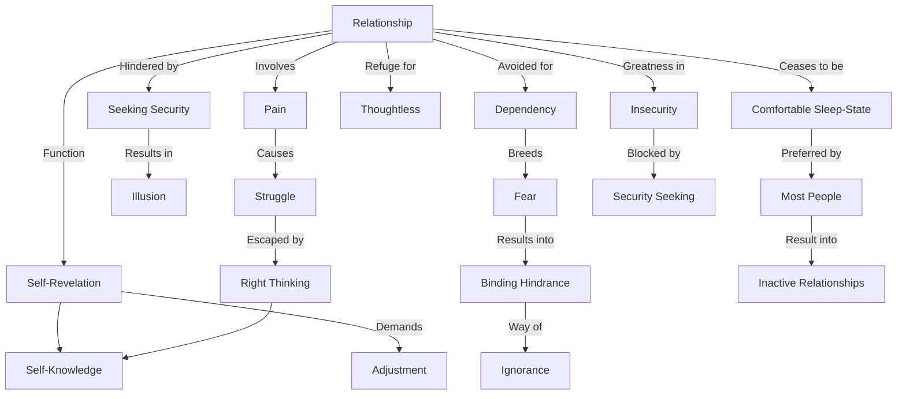

March 16
The function of relationship

Relationship is inevitably painful, which is shown in our every day existence. If in relationship there is no tension, it ceases to be relationship and merely becomes a comfortable sleep-state, an opiate—which most people want and prefer. Conflict is between this craving for comfort and the factual, between illusion and actuality. If you recognize the illusion then you can, by putting it aside, give your attention to the understanding of relationship. But if you seek security in relationship, it becomes an investment in comfort, in illusion and the greatness of relationship is its very insecurity.By seeking security in relationship you are hindering its function, which brings its own peculiar actions and misfortunes.
Surely, the function of relationship is to reveal the state of one’s whole being. Relationship is a process of self-revelation, of self-knowledge. This self-revelation is painful, demanding constant adjustment, pliability of thought-emotion. It is a painful struggle, with periods of enlightened peace...
But most of us avoid or put aside the tension in relationship, preferring the ease and comfort of satisfying dependency, an unchallenged security, a safe anchorage. Then family and other relationships become a refuge, the refuge of the thoughtless. When insecurity creeps into dependency, as it inevitably does, then that particular relationship is cast aside and a new one taken on in the hope of finding lasting security; but there is no security in relationship, and dependency only breeds fear. Without understanding the process of security and fear, relationship becomes a binding hindrance, a way of ignorance. Then all existence is struggle and pain, and there is no way out of it save in right thinking, which comes through self-knowledge.

