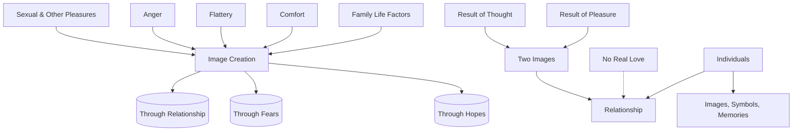

March 17
How can there be real love?

The image you have about a person, the image you have about your politicians, the prime minister, your god, your wife, your children—that image is being looked at. And that image has been created through your relationship, or through your fears, or through your hopes. The sexual and other pleasures you have had with your wife, your husband, the anger, the flattery, the comfort, and all the things that your family life brings—a deadly life it is—have created an image about your wife or husband. With that image you look. Similarly, your wife or husband has an image about you. So the relationship between you and your wife or husband, between you and the politician is really the relationship between these two images. Right? That is a fact. How can two images which are the result of thought, of pleasure and so on, have any affection or love?
So the relationship between two individuals, very close together or very far, is a relationship of images, symbols, memories. And in that, how can there be real love?

