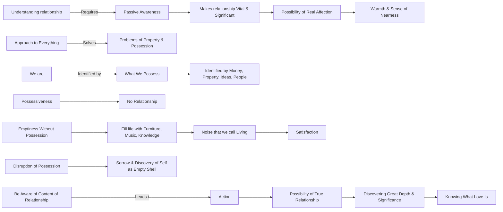

March 18
We are that which we possess

To understand relationship, there must be a passive awareness, which does not destroy relationship. On the contrary, it makes relationship much more vital, much more significant. Then there is in that relationship a possibility of real affection; there is a warmth, a sense of nearness, which is not mere sentiment or sensation. And if we can so approach or be in that relationship to everything, then our problems will be easily solved—the problems of property, the problems of possession. Because, we are that which we possess. The man who possesses money is the money. The man who identifies himself with property is the property, or the house, or the furniture. Similarly with ideas,or with people; and when there is possessiveness, there is no relationship. But most of us possess because we have nothing else, if we do not possess. We are empty shells if we do not possess, if we do not fill our life with furniture, with music, with knowledge, with this or that. And that shell makes a lot of noise, and that no ise we call living; and with that we are satisfied. And when there is a disruption, a breaking away of that, then there is sorrow because then you suddenly discover yourself as you are—an empty shell, without much meaning. So, to be aware of the whole content of relationship is action; and from that action there is a possibility of true relationship, a possibility of discovering its great depth, its great significance, and of knowing what love is.

