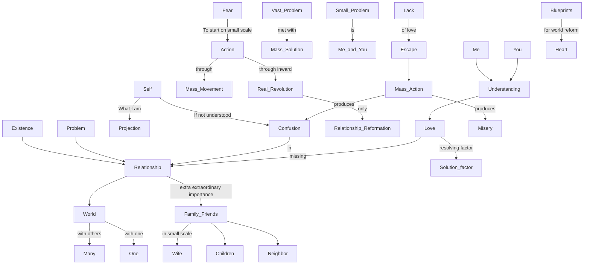

March 19
Being related

Without relationship, there is no existence: to be is to be related...Most of us do not seem to realize this—that the world is my relationship with others, whether one or many. My problem is that of relationship. What I am, that I project; and obviously, if I do not understand myself, the whole of relationship is one of confusion in ever-widening circles. So, relationship becomes of extraordinary importance, not with the so called mass, the crowd, but in the world of my family and friends, however small that may be—my relationship with my wife, my children, my neighbor. In a world of vast organizations, vast mobilizations of people, mass movements, we are afraid to act on a small scale; we are afraid to be little people clearing up our own patch. We say to ourselves, “What can I persona lly do? I must join a mass movement in order to reform.” On the contrary, real revolution takes place not through mass movements but through the inward revaluation of relationship—that alone is real reformation, a radical, continuous revolution. We are afraid to begin on a small scale. Because the problem is so vast, we think we must meet it with large numbers of people, with a great organization, with mass movements. Surely, we must begin to tackle the problem on a small scale, and the small scale is the “me” and the “you.” When I understand myself, I understand you, and out of that understanding comes love. Love is the missing factor; there is a lack of affection, of warmth in relationship; and because we lack that love, that tenderness, that generosity, that mercy in relationship, we escape into mass action which produces further confusion, further misery. We fill our hearts with blueprints for world reform and do not look to that one resolving factor which is love.
