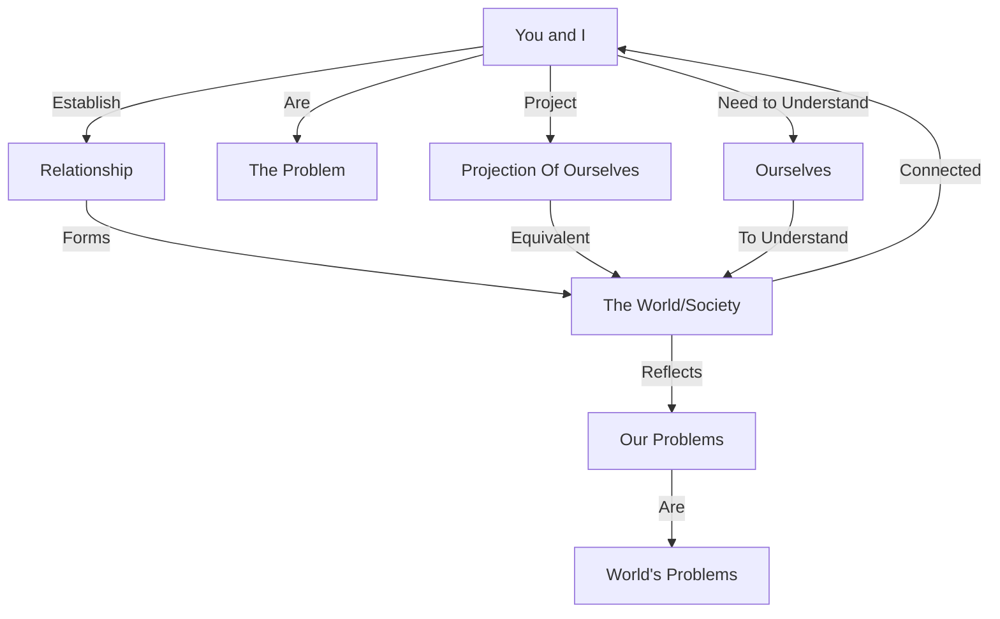

March 20
You and I are the problem, not the world

The world is not something separate from you and me, the world, society, is the relationship that we establish or seek to establish between each other. So you and I are the problem, and not the world, because the world is the projection of ourselves, and to understand the world we must understand ourselves. That world is not separate from us; we are the world, and our problems are the world’s problems.

