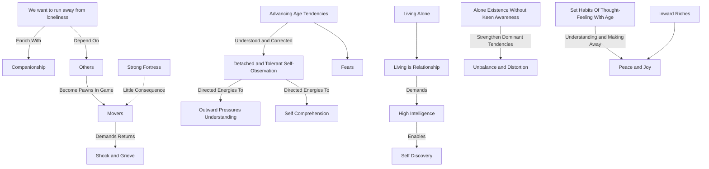

March 21
There is no such thing as living alone

We want to run away from our loneliness, with its panicky fears, so we depend on another, we enrich ourselves with companionship, and so on. We are the prime movers, and other become pawns in our game; and when the pawn turns and demands something in return, we are shocked and grieved. If our own fortress is strong, without a weak spot in it, this battering from the outside is of little consequence to us. The peculiar tendencies that arise with advancing age must be understood and corrected while we are still capable of detached and tolerant self-observation and study; our fears must be observed and understood now. Our energies must be directed, not merely to the understanding of the outward pressures and demands for which we are responsible, but to the comprehension of ourselves, of our loneliness, our fears, demands, and frailties.
There is no such thing as living alone, for all living is relationship; but to live without direct relationship demands high intelligence, a swifter and greater awareness for self- discovery. A “lone” existence, without this keen and flowing awareness, strengthens the already dominant tendencies, thus causing unbalance, distortion. It is now that one has to become aware of the set and peculiar habits of thought-feeling which come with age, and by understanding them make away with them. Inward riches alone bring peace and joy.

