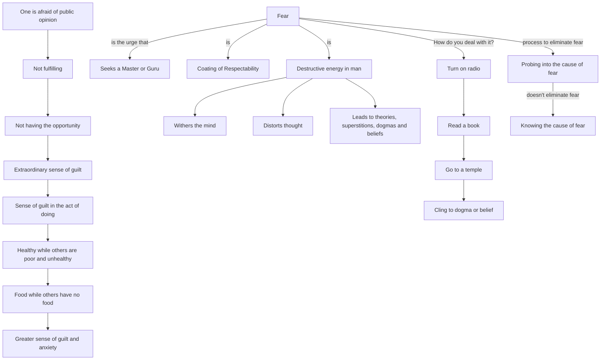

March 23
Dealing with fear?

One is afraid of public opinion, afraid of not achieving, not fulfilling, afraid of not having the opportunity; and through it all there is this extraordinary sense of guilt—one has done a thing that one should not have done; the sense of guilt in the very act of doing; one is healthy and others are poor and unhealthy; one has food and others have no food. The more the mind is inquiring, penetrating, asking, the greater the sense of guilt, anxiety...Fear is the urge that seeks a Master, a guru; fear is this coating of respectability, which every one loves so dearly—to be respectable. Do you determine to be courageous to face events in life, or merely rationalize fear away, or find explanations that will give satisfaction to the mind that is caught in fear? How do you deal with it? Turn on the radio, read a book, go to a temple, cling to some form of dogma, belief?
Fear is the destructive energy in man. It withers the mind, it distorts thought, it leads to all kinds of extraordinarily clever and subtle theories, absurd superstitions, dogmas and beliefs. If you see that fear is destructive, then how do you proceed to wipe the mind clean? You say that by probing into the cause of fear you would be free of fear. Is that so? Trying to uncover the cause and knowing the cause of fear does not eliminate fear.

