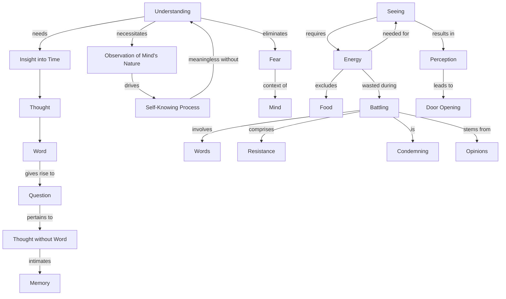

March 24
The door to understanding

You cannot wipe away fear without understanding, without actually seeing into the nature of time, which means thought, which means word. From that arises the question: Is there a thought without word, is there a thinking without the word which is memory? Sir, without seeing the nature of the mind, the movement of the mind, the process of self-knowing, merely saying that I must be free of it, has very little meaning. You have to take fear in the context of the whole of the mind. To see, to go into all this, you need energy. Energy does not come through eating food that is a part of physical necessity. But to see, in the sense I am using that word, requires an enormous energy,  and that energy is dissipated when you are battling with words, when you are resisting, condemning, when you are full of opinions which are preventing you from looking, seeing - your energy is all gone in that. So in the consideration of this perception, this seeing, again you open the door.

