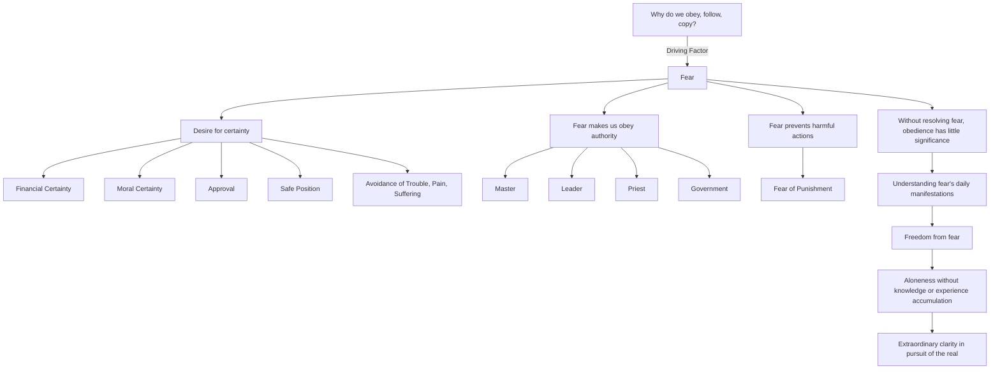

March 25
Fear makes us obey

Why do we do all this—obey, follow, copy? Why? Because, we are frightened inwardly to be uncertain. We want to be certain—we want to be certain financially, we want to be certain morally—we want to be approved, we want to be in a safe position, we want never to be confronted with trouble, pain, suffering, we want to be enclosed. So, fear, consciously or unconsciously, makes us obey the Master, the leader, the priest, the government. Fear also controls us from doing something which may be harmful to others, because we will be punished. So behind all these actions, greeds, pursuits, lurks this desire for certainty, this desire to be assured. So, without resolving fear, without being free from fear, merely to obey or to be obeyed has little significance; what has meaning is to understand this fear from day to day and how fear shows itself in different ways. It isonly when there is freedom from fear that there is that inward quality of understanding, that aloneness in which there is no accumulation of knowledge or of experience, and it is that alone which gives extraordinary clarity in the pursuit of the real.

