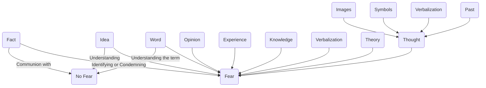

March 26
Face-to-face with the fact

Are we afraid of a fact or of an idea about the fact? Are we afraid of the thing as it is, or are we afraid of what we think it is? Take death, for example. Are we afraid of the fact of death or of the idea of death? The fact is one thing and the idea about the fact is another. Am I afraid of the word death or of the fact itself? Because I am afraid of the word, of the idea, I never understand the fact, I never look at the fact, I am never in direct relation with the fact. It is only when I am in complete communion with the fact that there is no fear. If I am not in communion with the fact, then there is fear, and there is no communion with the fact so long as I have an idea, an opinion, a theory, about the fact, so I have to be very clear whether I am afraid of the word, the idea, or the fact. If I am face- to-face with the fact, there is nothing to understand about it: the fact is there, and I can deal with it. If I am afraid of the word, then I must understand the word, go into the whole process of what the word, the term, implies.
It is my opinion, my idea, my experience, my knowledge about the fact, that creates fear. So long as there is verbalization of the fact, giving the fact a name and therefore identifying or condemning it, so long as thought is judging the fact as an observer, there must be fear. Thought is the product of the past; it can only exist through verbalization, through symbols, through images. So long as thought is regarding or translating the fact, there must be fear. Thought is the product of the past, it can only exist through verbalization, through symbols, through images; so long as thought is regarding or translating the fact, there must be fear.

