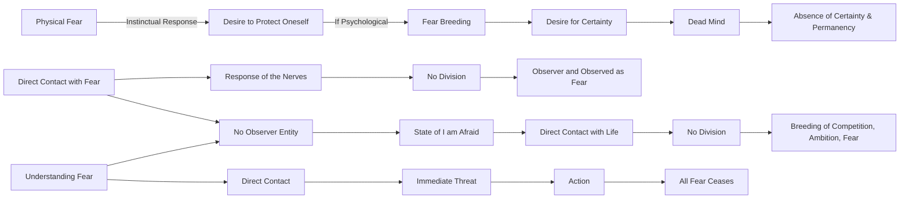

March 27
Contacting fear

There is physical fear. You know, when you see a snake, a wild animal, instinctively there is fear; that is a normal, healthy, natural fear. It is not fear, it is a desire to protect oneself—that is normal. But the psychological protection of oneself—that is, the desire to be always certain—breeds fear. A mind that is seeking always to be certain is a dead mind, because there is no certainty in life, there is no permanency...When you come directly into contact with fear, there is a response of the nerves and all the rest of it. Then, when the mind is no longer escaping through words or through activity of any kind, there is no division between the observer and the thing observed as fear. It is only the mind that is escaping that separates itself from fear. But when there is a direct contract with fear, there is no observer, there is no entity that says, “I am afraid.” So, the moment you are directly in contact with life, with anything, there is no division—it is this division that breeds competition, ambition, fear.So what is important is not “how to be free of fear?” If you seek a way, a method, a system to be rid of fear, you will be everlastingly caught in fear. But if you understand fear—which can only take place when you come directly in contact with it, as you are in contact with hunger, as you are directly in contact when you are threatened with losing your job—then you do something; only then will you find that all fear ceases—we mean all fear, not fear of this kind or of that kind.

