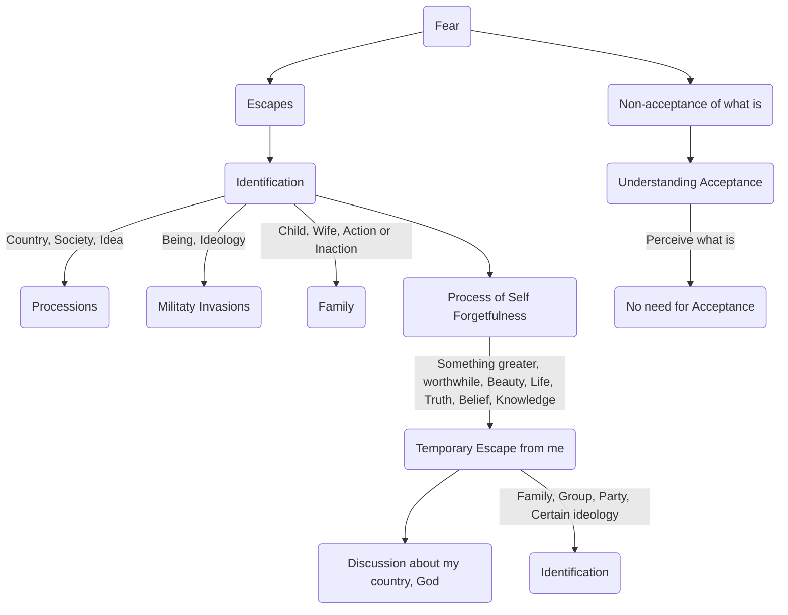

March 28
Fear is non-acceptance of what is

Fear finds various escapes. The common variety is identification, is it not?— identification with country, with society, with an idea. Haven’t you noticed how you respond when you see a procession, a military procession or a religious procession, or when the country is in danger of being invaded? You then identify yourself with the country, with a being, with an ideology. There are other times when you identify yourself with your child, with your wife, with a particular form of action, or inaction. Identification is a process of self-forgetfulness. So long as I am conscious of the “me” I know there is pain, there is struggle, there is constant fear. But if I can identify myself with something greater, with something worthwhile, with beauty, with life, with truth, with belief, with knowledge, at least temporarily, there is an escape from the “me,” is there not? If I talk about “my country” I forget myself temporarily, do I not? If I can say something about God, I forget myself. If I can identify myself with my family, with a group, with a particular party, with a certain ideology, then there is a temporary escape.
Do we now know what fear is? Is it not the non-acceptance of what is? We must understand the word acceptance. I am not using that word as meaning the effort made to accept. There is no question of accepting when I perceive what is. When I do not see clearly what is, then I bring in the process of acceptance. Therefore fear is the non- acceptance of what is.

