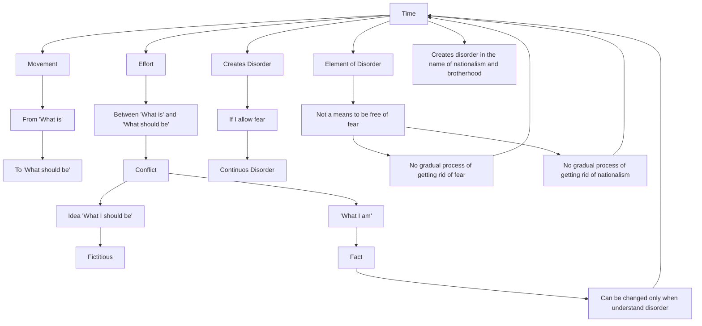

March 29
The disorder that time creates

Create a Mermaid Concept Map Diagram in text format identifying key concepts and keeping their names short  and name their relationships from this corresponding underlying text below from Jiddu Krishnamurti,  do not provide explanations or any further list or notes, only provide this Mermaid Concept Map Diagram in text format.

Time means moving from what is to “what should be.” I am afraid, but one day I shall be free of fear; therefore, time is necessary to be free of fear—at least, that is what we think. To change from what is to “what should be” involves time. Now, time implies effort in that interval between what is and “what should be.” I don’t like fear, and I am going to make an effort to understand, to analyze, to dissect it, or I am going to discover the cause of it, or I am going to escape totally from it. All this implies effort—and effort is what we are used to. We are always in conflict between what is and “what should be.” The “what I should be” is an idea, and the idea is fictitious, it is not “what I am,” which is the fact; and the “what I am” can be changed only when I understand the disorder that time creates.
So, is it possible for me to be rid of fear totally, completely, on the instant? If I allow fear to continue, I will create disorder all the time; therefore, one sees that time is an element of disorder, not a means to be ultimately free of fear. So there is no gradual process of getting rid of fear, just as there is no gradual process of getting rid of the poison of nationalism. If you have nationalism and you say that eventually there will be the brotherhood of man, in the interval there are wars, there are hatreds, there is misery, there is all this appalling division between man and man; therefore, time is creating disorder.

