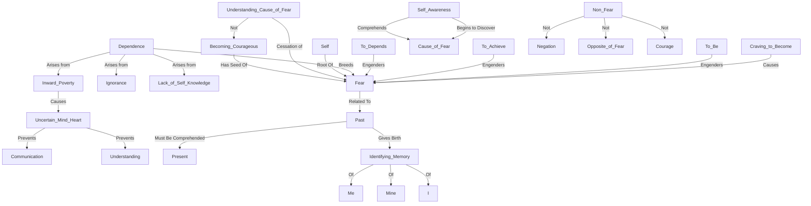

March 31
The root of all fear

The craving to become causes fears; to be, to achieve, and so to depend engenders fear. The state of the non-fear is not negation, it is not the opposite of fear nor is it courage. In understanding the cause of fear, there is its cessation, not the becoming courageous, for in all becoming there is the seed of fear. Dependence on things, on people, or on ideas breeds fear; dependence arises from ignorance, from the lack of self-knowledge, from inward poverty; fear causes uncertainty of mind-heart, preventing communication and understanding. Through self-awareness we begin to discover and so comprehend the cause of fear, not only the superficial but the deep casual and accumulative fears. Fear is both inborn and acquired; it is related to the past, and to free thought-feeling from it, the past must be comprehended through the present. The past is ever wanting to give birth tothe present which becomes the identifying memory of the “me” and the “mine,” the “I.” The self is the root of all fear.

