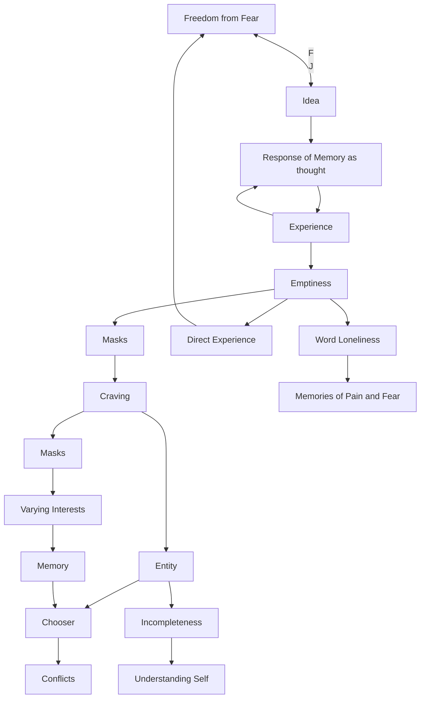

April 1
There is only craving

There is no entity separate from craving; there is only craving, there is no one who craves. Craving takes on different masks at different times, depending on its interests. The memory of these varying interests meets the new, which brings about conflict, and so the chooser is born, establishing himself as an entity separate and distinct from craving. But the entity is not different from its qualities. The entity who tries to fill or run away from emptiness, incompleteness, loneliness, is not different from that which he is avoiding; he is it. He cannot run away from himself; all that he can do is to understand himself. He is his loneliness, his emptiness; and as long as he regards it as something separate from himself; he will be in illusion and endless conflict. When he directly experiences that he is his own loneliness, then only can there be freedom from fear. Fear exists only in relationship to an idea, and idea is the response of memory as thought. Thought is the result of experience; and though it can ponder over emptiness, have sensations with regard to it, it cannot know emptiness directly. The word loneliness, with its memories of pain and fear, prevents the experiencing of it afresh. The word is memory, and when the word is no longer significant, then the relationship between the experiencer and the experienced is wholly different; then that relationship is direct and not through a word, through memory; then the experiencer is the experience, which alone brings freedom from fear.

