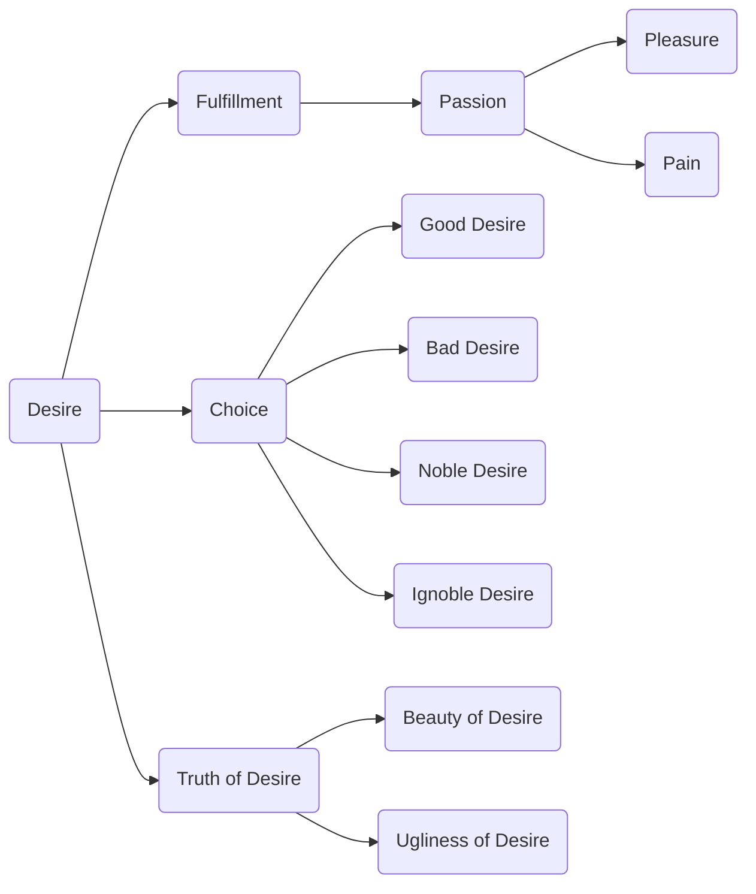

April 2 
Understanding desire

We have to understand desire; and it is very difficult to understand something which is so vital, so demanding, so urgent because in the very fulfillment of desire passion is engendered, with the pleasure and the pain of it. And if one is to understand desire, obviously, there must be no choice. You cannot judge desire as being good or bad, noble or ignoble, or say, “I will keep this desire and deny that one.” All that must be set aside if we are to find out the truth of desire—the beauty of it, the ugliness or whatever it may be.

