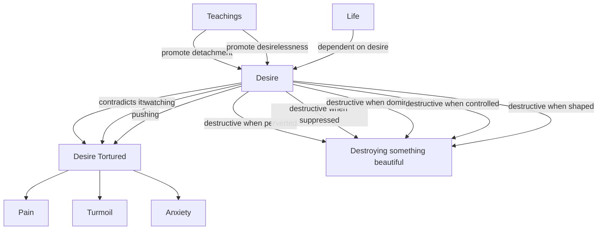

April 3
Desire has to be understood

Create a Mermaid Concept Map Diagram in text format identifying key concepts and keeping their names short  and name their relationships from this corresponding underlying text below from Jiddu Krishnamurti,  do not provide explanations or any further list or notes, only provide this Mermaid Concept Map Diagram in text format.

Let us go on to consider desire. We know, do we not, the desire which contradicts itself, which is tortured, pulling in different directions; the pain, the turmoil, the anxiety of desire, and the disciplining, the controlling. And in the everlasting battle with it we twist it out of all shape and recognition; but it is there, constantly watching, waiting, pushing. Do what you will, sublimate it, escape from it, deny it or accept it, give it full rein—it is always there. And we know how the religious teachers and others have said that we should be desireless, cultivate detachment, be free from desire—which is really absurd, because desire has to be understood, not destroyed. If you destroy desire, you may destroy life itself. If you pervert desire, shape it, control it, dominate it, suppress it, you may be destroying something extraordinarily beautiful.

