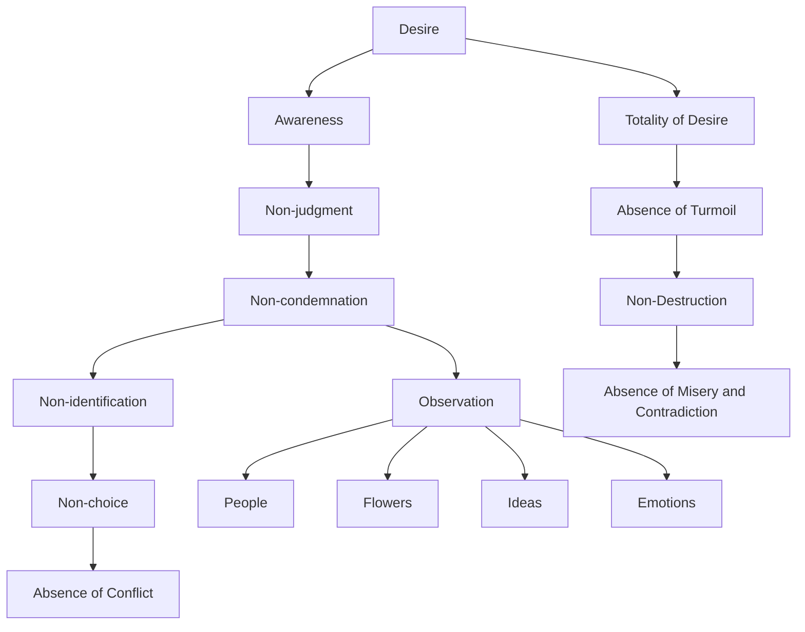

April 4
The quality of desire

What happens if you do not condemn desire, do not judge it as being good or bad, but simply be aware of it? I wonder if you know what it means to be aware of something? Most of us are not aware because we have become so accustomed to condemning, judging, evaluating, identifying, choosing. Choice obviously prevents awareness because choice is always made as a result of conflict. To be aware when you enter a room, to see all the furniture, the carpet or its absence, and so on—just to see it, to be aware of it all without any sense of judgment—is very difficult. Have you ever tried to look at a person, a flower, at an idea, an emotion, without any choice, any judgment?
And if one does the same thing with desire, if one lives with it—not denying it or saying, “What shall I do with this desire? It is so ugly, so rampant, so violent,” not giving it a name, a symbol, not covering it with a word—then, is it any longer the cause of turmoil? Is desire then something to be put away, destroyed? We want to destroy it because one desire tears against another creating conflict, misery and contradiction; and one can see how one tries to escape from this everlasting conflict. So can one be aware of the totality of desire? What I mean by totality is not just one desire or many desires, but the total quality of desire itself.

