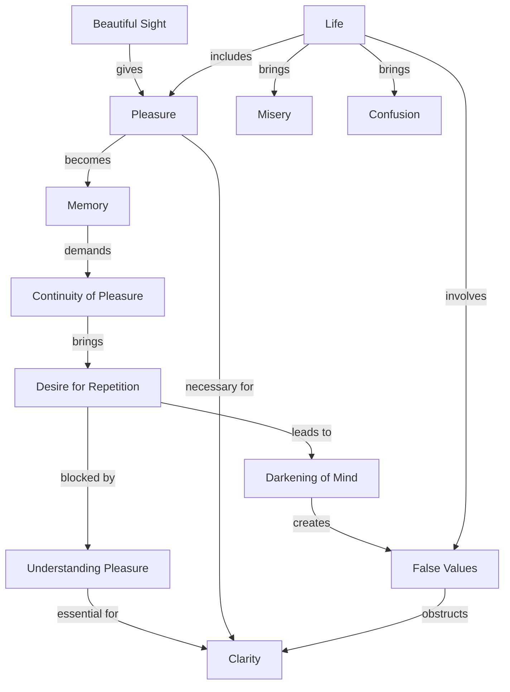

April 5
Why shouldn’t one have pleasure?

You see a beautiful sunset, a lovely tree, a river that has a wide, curving movement, or a beautiful face, and to look at it gives great pleasure, delight. What is wrong with that? It seems to me the confusion and the misery begin when that face, that river, that cloud, that mountain becomes a memory, and this memory then demands a greater continuity of pleasure; we want such things repeated. We all know this. I have had a certain pleasure, or you have had a certain delight in something, and we want it repeated. Whether it be sexual, artistic, intellectual, or something not quite of this character, we want it repeated—and I think that is where pleasure begins to darken the mind and create values which are false, not actual.
What matters is to understand pleasure, not try to get rid of it—that is too stupid. Nobody can get rid of pleasure. But to understand the nature and the structure of pleasure is essential; because if life is only pleasure, and if that is what one wants, then with pleasure go the misery, the confusion, the illusions, the false values which we create, and therefore there is no clarity.

