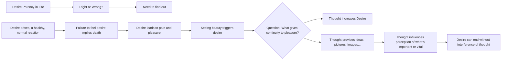

April 6
A healthy, normal reaction

I have to find out why desire has such potency in my life. It may be right or it may not be right. I have to find out. I see that. Desire arises, which is a reaction, which is a healthy, normal reaction; otherwise, I would be dead. I see a beautiful thing and I say, “By Jove, I want that.” If I didn’t, I’d be dead. But in the constant pursuit of it there is pain. That’s my problem—there is pain as well as pleasure. I see a beautiful woman, and she is beautiful; it would be most absurd to say, “No, she’s not.” This is a fact. But what gives continuity to the pleasure? Obviously it is thought, thinking about it.
I think about it. It is no longer the direct relationship with the object, which is desire, but thought now increases that desire by thinking about it, by having images, pictures, ideas...
Thought comes in and says, “Please, you must have it; that’s growth; that is important; that is not important; this is vital for your life; this is not vital for your life.”
But I can look at it and have a desire, and that’s the end of it, without interference of thought.

