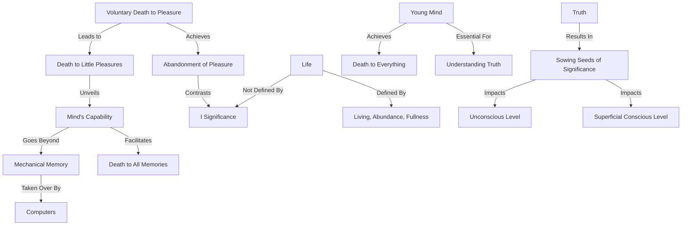

April 7
Dying to little things

Have you ever tried dying to a pleasure voluntarily, not forcibly? Ordinarily when you die you don’t want to; death comes and takes you away; it is not a voluntary act, except in suicide. But have you ever tried dying voluntarily, easily, felt that sense of the abandonment of pleasure? Obviously not! At present your ideals, your pleasures, your ambitions are the things which give so-called significance to them. Life is living, abundance, fullness, abandonment, not a sense of the “I” having significance. That is mere intellection. If you experiment with dying to little things—that is good enough. Just to die to little pleasures—with ease, with comfort, with a smile—is enough, for then you will see that your mind is capable of dying to many things, dying to all memories. Machines are taking over the functions of memory—the computers—but the human mind is something more than a merely mechanical habit of association and memory. But it cannot be that something else if it does not die to everything it knows.
Now to see the truth of all this, a young mind is essential, a mind that is not merely functioning in the field of time. The young mind dies to everything. Can you see the truth of that immediately, feel the truth of it instantly? You may not see the whole extraordinary significance of it, the immense subtlety, the beauty of that dying, the richness of it, but even to listen to it sows the seed, and the significance of these words takes root—not only at the superficial, conscious level, but right through all the unconscious.

