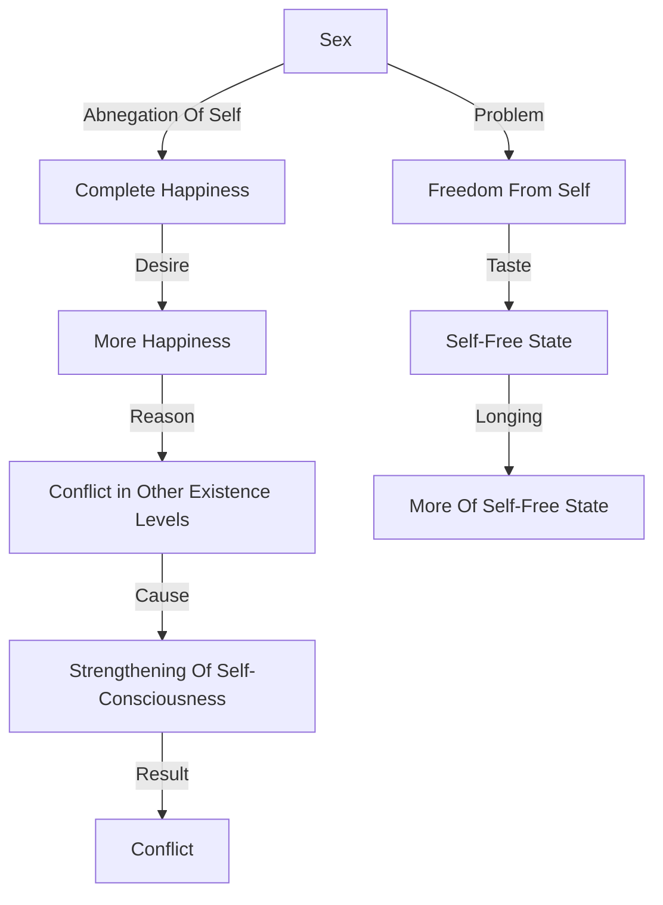

April 8 
Sex

Sex is a problem because it would seem that in that act there is complete absence of the self. In that moment you are happy, because there is the cessation of self-consciousness, of the “me”; and desiring more of it—more of the abnegation of the self in which there is complete happiness, without the past or the future demanding that complete happiness through full fusion, integration—naturally it becomes all-important. Isn’t that so? Because it is something that gives me unadulterated joy, complete self forgetfulness, I want more and more of it. Now, why do I want more of it? Because, everywhere else I am in conflict, everywhere else, at all the different levels of existence, there is the strengthening of the self. Economically, socially, religiously, there is the constant thickening of self-consciousness, which is conflict. After all, you are self-conscious only when there is conflict. Self-consciousness is in its very nature the result of conflict.
So, the problem is not sex, surely, but how to be free from the self. You have tasted that state of being in which the self is not, if only for a few seconds, if only for a day, or what you will; and where the self is, there is conflict, there is misery, there is strife. So, there is the constant longing for more of that self- free state.

