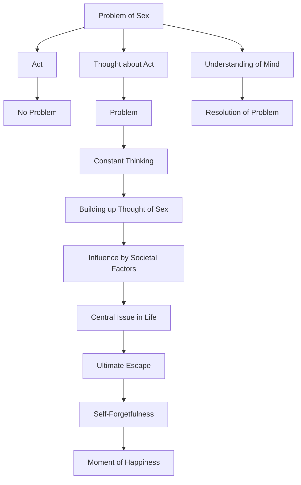

April 9
The ultimate escape

What do we mean by the problem of sex? Is it the act, or is it a thought about the act? Surely, it is not the act. The sexual act is no problem to you any more than eating is a problem to you, but if you think about eating or anything else all day long because you have nothing else to think about, it becomes a problem to you...Why do you build it up, which you are obviously doing? The cinemas, the magazines, the stories, the way women dress, everything is building up your thought of sex. And why does the mind build it up, why does the mind think about sex at all? Why, sirs and ladies? It is your problem. Why? Why has it become a central issue in your life? When there are so many things calling, demanding your attention, you give complete attention to the thought of sex. What happens, why are your minds so occupied with it? Because that is a way of ultimate escape, is it not? It is a way of complete self-forgetfulness. For the time being, at least for the moment, you can forget yourself—and there is no other way of forgetting yourself. Everything else you do in life gives emphasis to the “me,” to the self. Your business, your religion, your gods, your leaders, your political and economic actions, your escapes, your social activities, your joining one party and rejecting another—all that is emphasizing and giving strength to the “me”...When there is only one thing in your life which is an avenue to ultimate escape, to complete forgetfulness of yourself if only for a few seconds, you cling to it because that is the only moment you are happy...
So, sex becomes an extraordinary difficult and complex problem as long as you do not understand the mind which thinks about the problem.

