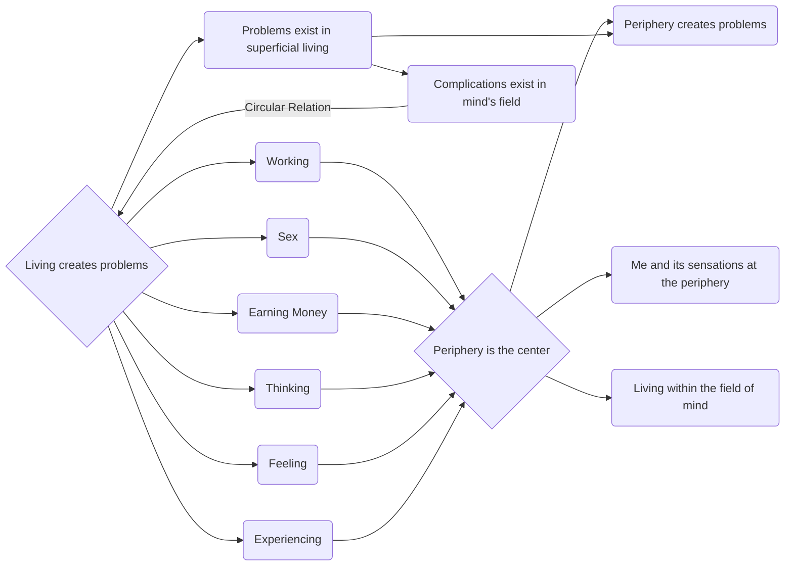

April 10
We have made sex a problem

Why is it that whatever we touch we turn into a problem? Why has sex become a problem? Why do we submit to living with problems; why do we not put an end to them? Why do we not die to our problems instead of carrying them day after day, year after year? Surely, sex is a relevant question, which I shall answer presently, but there is the primary question: why do we make life into a problem? Working, sex, earning money, thinking, feeling, experiencing, you know, the whole business of living—why is it a problem? Is it not essentially because we always think from a particular point of view, from a fixed point of view? We are always thinking from a center towards the periphery, but the periphery is the center for most of us, and so anything we touch is superficial. But life is not superficial; it demands living completely, and because we are living only superficially, we know only superficial reaction. Whatever we do on the periphery must inevitably create a problem, and that is our life—we live in the superficial and we are content to live there with all the problems of the superficia l. So, problems exist as long as we live in the superficial, on the periphery—the periphery being the “me” and its sensations, which can be externalized or made subjective, which can be identified with the universe, with the country, or with some other thing made up by the mind. So, as long as we live within the field of the mind there must be complications, there must be problems; and that is all we know.

